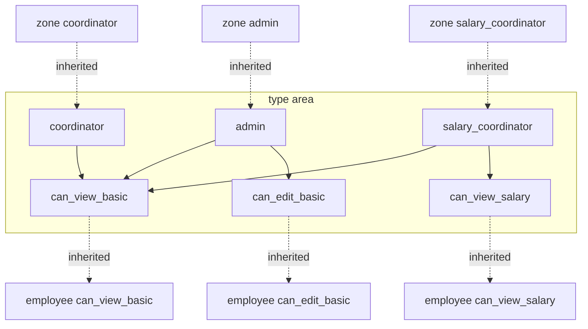
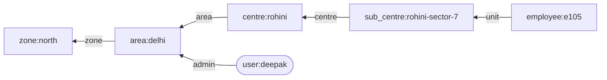

# Day-to-day changes: what you enter in OpenFGA and in custom SQL

As of 9 October 2026. Related: [tech-design.md](tech-design.md),
[list-queries-comparison.md](list-queries-comparison.md).

This walks through the routine events (a new user, a new grant, a new action, a new screen) and
shows what has to be entered or changed in each approach, and who does it.

The short version: **granting access is one row in both.** The difference is in changing the rules.
In your SQL design, which role allows which action is data that an admin can change at runtime. In
OpenFGA it is part of the model, which a developer changes and deploys like code.

## Your SQL design, as I understand it

You described the classic design: `role`, `permission`, `role_permission`, a user-to-role
assignment, and a scope table with `zone_id`, `area_id`, `centre_id` columns that says where the
role applies. A filled column narrows the scope; an empty one means "all below".

```sql
role (id, code)                      -- admin, coordinator, salary_coordinator
permission (id, code)                -- view_basic, edit_basic, view_salary
role_permission (role_id, permission_id)

-- One row = this user holds this role over this part of the organisation.
user_access (id, user_id, role_id,
             zone_id NOT NULL, area_id, centre_id, sub_centre_id,   -- NULL = everything below
             department)                                           -- NULL = all departments

employee (id, ..., department, zone_id, area_id, centre_id, sub_centre_id)
```

| `user_access` row | Meaning |
| --- | --- |
| anita, admin, north, NULL, NULL | Admin of the whole North zone |
| deepak, admin, north, delhi, NULL | Admin of Delhi area only |
| esha, coordinator, north, delhi, rohini | Coordinator of Rohini centre only |
| gita, coordinator, north, NULL, NULL, department hr | Coordinator of North, HR employees only |

The check and the list are the same clause:

```sql
SELECT e.* FROM employee e
WHERE EXISTS (
  SELECT 1
  FROM user_access ua
  JOIN role_permission rp ON rp.role_id = ua.role_id
  JOIN permission p       ON p.id = rp.permission_id
  WHERE ua.user_id = :user AND p.code = :permission
    AND ua.zone_id = e.zone_id
    AND (ua.area_id       IS NULL OR ua.area_id       = e.area_id)
    AND (ua.centre_id     IS NULL OR ua.centre_id     = e.centre_id)
    AND (ua.sub_centre_id IS NULL OR ua.sub_centre_id = e.sub_centre_id)
    AND (ua.department    IS NULL OR ua.department    = e.department)
);
```

I ran this in a throwaway Postgres database with 6 employees and 5 grants. It gave the expected
answers for a zone admin, an area admin, a centre coordinator, an HR-only coordinator and a salary
coordinator. It is a sound design, with the trade-offs listed near the end.

## The same pieces in OpenFGA

| Your SQL piece | OpenFGA equivalent | Where it lives |
| --- | --- | --- |
| `role` rows | Role relations: `admin`, `coordinator`, `salary_coordinator` | Model file |
| `permission` rows | Permission relations: `can_view_basic`, `can_edit_basic`, `can_view_salary` | Model file |
| `role_permission` rows | Lines such as `define can_edit_basic: admin` | Model file |
| `user_access` rows | Grant tuples: `user:anita` is `admin` of `zone:north` | Tuple table |
| `zone_id`, `area_id`, `centre_id` columns on employee | Parent-link tuples and one placement tuple per employee | Tuple table |
| The `EXISTS` clause | Nothing to write; OpenFGA derives it from the model | Built in |
| `user` table | Nothing; a user exists as soon as a tuple names them | Not stored |

## What the graph looks like

There are two graphs. The model is the graph of rules. The tuples are the graph of facts. A check
walks the facts, guided by the rules.

### The rules (from `fga/model.fga`)

Each level repeats the same pattern, so one level is shown.



Solid arrows are your `role_permission` table. Dotted arrows are the hierarchy, which in SQL is the
set of `IS NULL OR =` lines in the query.

### The facts (tuples) used for one check

`Check(user:deepak, can_edit_basic, employee:e105)`:



OpenFGA starts at the employee, follows the links upward, and at each unit asks whether Deepak is
admin there. It finds the grant on Delhi and answers yes. Five tuples are involved, and none of them
mentions Deepak and e105 together.

## Routine events side by side

### Access changes: done by an administrator, no deployment

| Event | OpenFGA | Your SQL design |
| --- | --- | --- |
| New user joins the system | Nothing | 1 row in `user` |
| Give a user a role on an area | Write 1 tuple: `user:ravi` `coordinator` `area:delhi` | 1 row in `user_access` |
| Give the same user a second area | Write 1 more tuple | 1 more row in `user_access` |
| Give a role on 3 centres only | 3 tuples | 3 rows |
| Limit a grant to HR | The tuple carries the condition `allowed_departments: ["hr"]` | `department = 'hr'` on the row |
| Remove a grant | Delete 1 tuple | Delete 1 row |
| Grant to a group | 1 tuple naming `group:payroll-south#member` | Needs a group table and an extra join in every query |
| New centre opens | 1 parent-link tuple | 1 row in `centre` |
| Employee joins or transfers | 1 placement tuple written (and 1 deleted on transfer) | Update the employee's `zone_id`, `area_id`, `centre_id` |
| Centre moves to another area | 1 tuple deleted, 1 written | Update `area_id` on the centre and on every employee in it, and fix any `user_access` row that names the old area with that centre |

The last row is the main structural difference. In your design, Esha's row says `delhi, rohini`. If
Rohini moves to Punjab, that row no longer matches any employee and she silently loses access until
someone corrects it.

### Rule changes: where the two differ most

| Event | OpenFGA | Your SQL design |
| --- | --- | --- |
| New action, such as Export | Developer adds one line per type to the model, runs the tests, publishes the model, and adds the check in the application | Admin inserts 1 `permission` row and the `role_permission` rows; developer adds the check in the application |
| Change what a role can do, such as letting Admin see salary | Developer edits one line per type in the model and publishes it | Admin inserts 1 `role_permission` row |
| New role, such as Auditor | Developer adds the relation to each type and to the permissions it grants, publishes the model; then grants are tuples | Admin inserts 1 `role` row and its `role_permission` rows; then grants are rows |
| New level in the hierarchy | Developer adds a type to the model; existing tuples are untouched | New column on `user_access` and `employee`, and a new line in every query that checks access |
| New kind of record, such as leave requests | Developer adds a type that points at a unit; it inherits every existing grant | New table with the scope columns, and the `EXISTS` clause added to its queries |

I tried the "new action" case both ways. In OpenFGA, adding `can_export` to a copy of the model
gave the right answers with no tuple changes. In SQL, two inserts did the same.

### Sequence for a new action in OpenFGA

1. Developer edits `fga/model.fga`: `define can_export: admin or salary_coordinator` on each unit
   type, and `define can_export: can_export from unit` on employee.
2. Developer adds cases to `fga/store.fga.yaml` and runs the model tests.
3. The pipeline publishes the model. OpenFGA stores it as a new version with a new id; older
   versions remain.
4. The application is deployed with the new model id and the new check on the Export endpoint.
5. No tuples change. Everyone who already holds admin or salary coordinator can export.

The POC has `npm run setup`, which creates a fresh store. It has no script for publishing a new
model version into an existing store, so step 3 is not built.

### Sequence for a new action in SQL

1. Admin, or a migration script, inserts the `permission` row and the `role_permission` rows.
2. Developer adds the check on the Export endpoint and deploys.
3. No grant rows change.

## New screen

Neither OpenFGA nor the database knows what a screen is. The usual approach is the same in both:
a screen is shown when the user holds the permission that screen needs.

| Step | OpenFGA | Your SQL design |
| --- | --- | --- |
| Decide what the screen needs | Reuse an existing permission, or add a new one (see "new action") | Same |
| Should the menu item appear? | Ask "does this user hold `can_view_salary` on any unit?" (a list call on units that returns at least one) | `SELECT EXISTS` over `user_access` joined to `role_permission` |
| Protect the data behind the screen | Check on each request, as today | The `EXISTS` clause, as today |

If you want screens assigned independently of data permissions, with a `screen` table and
`role_screen` rows, that works in SQL as you have done before. In OpenFGA it would mean adding a
`screen` type to the model. I would avoid that in both: a menu that is separate from the data
permission lets the two drift, and the menu is never the real control.

The POC does not have a menu or a "what can I see?" endpoint. It returns permission flags per
employee row instead.

## Who changes what

| Change | OpenFGA | Your SQL design |
| --- | --- | --- |
| Who has which role where | Admin screen writes tuples | Admin screen writes rows |
| Which role allows which action | Developer, through a reviewed model change | Admin, at runtime, by editing rows |
| How the hierarchy inherits | Developer, in the model | Developer, in every query |

Whether runtime editing of `role_permission` is an advantage depends on your controls. It allows
custom roles without a release. It also means someone can widen access with one insert and no
review. OpenFGA publishes a "custom roles" sample that makes roles editable at runtime through
tuples; I have not tried it.

## Trade-offs of the column-per-level design

| Strength | Weakness |
| --- | --- |
| Familiar, and easy to read in a table viewer | A new level means new columns and edits to every access query |
| One query for checks, lists and reports | Every table that needs access control must carry all the level columns |
| Role-to-permission mapping is editable data | Moving a centre means rewriting employee rows and correcting grant rows |
| Nothing extra to run | The access clause must be repeated in every query; one missed query is a leak |
| | Groups, delegation and per-record sharing each need new tables and joins |
| | Each application needs its own copy of the tables, or a shared service in front of them |

The closure-table variant in [list-queries-comparison.md](list-queries-comparison.md) fixes the
first three weaknesses by storing a single `unit_id` on grants and employees. It keeps the last three.

## Which fits your situation

- **One business application, fixed levels, role-based access only:** your SQL design is simpler
  and handles lists and reports directly.
- **Many applications sharing the same zones, areas and centres, some needing per-record access
  such as workflow approvals, health records and devices:** the SQL design has to be duplicated or
  wrapped in a service, and per-record access does not fit the scope columns. That is where OpenFGA
  earns its extra moving parts.
