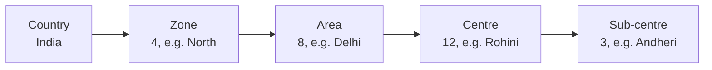
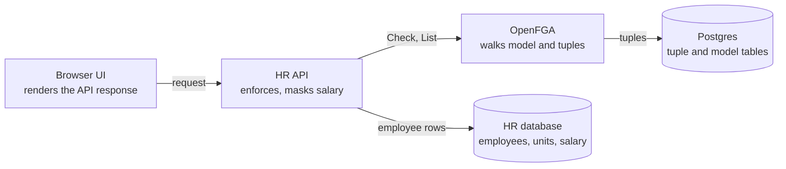

# Tech design: employee access control with OpenFGA

As of 9 October 2026, against OpenFGA v1.22.0. Requirements: [requirements.md](requirements.md).

## Summary

OpenFGA can meet every requirement, and the POC in this repo proves it: 68 stored facts describe
the whole organisation and all grants, and every access scenario passes.

- **It is not Salesforce-style.** OpenFGA keeps no access record per user per employee. It stores
  who holds which role on which unit, plus the organisation tree, and works out each answer when asked.
- **Changes are instant and cheap.** Granting a zone admin is one row. Moving a centre to another
  area is one row changed, and everyone's access follows on the next request.
- **Lists are the weak spot.** "Show me all my employees" takes extra design that a share table
  gives for free. The POC shows three ways to do it.
- **Recommendation:** use OpenFGA if these rules will be shared beyond one HR application. For a
  single application on one database, a custom closure-table design is simpler to run.

## How OpenFGA works, and how it differs from Salesforce

### The two things OpenFGA stores

- **Authorization model.** A schema that names the object types (zone, area, centre, employee) and
  the rules that connect them, such as "an area admin is anyone who is admin of the area's zone".
- **Relationship tuples.** Facts of the form user, relation, object. `user:anita` is `admin` of
  `zone:north`. `zone:north` is `zone` of `area:delhi`. `centre:rohini` is `unit` of `employee:e103`.

Both live in ordinary database tables. The Postgres schema has a
[`tuple` table](https://raw.githubusercontent.com/openfga/openfga/main/assets/migrations/postgres/001_initialize_schema.sql)
with the columns store, object_type, object_id, relation, _user and user_type, plus
`authorization_model`, `store`, `assertion` and `changelog` tables. See them with:

```sh
docker compose exec postgres psql -U postgres \
  -c "select object_type, object_id, relation, _user, condition_name from tuple order by ulid;"
```

### What happens on a check

The application calls `Check(user:anita, can_view_basic, employee:e103)`. OpenFGA walks the graph at
that moment: employee to centre, centre to area, area to zone, then looks for an admin tuple for
Anita on the zone. The [relationship queries page](https://openfga.dev/docs/interacting/relationship-queries)
says it will "resolve all prerequisite relationships to establish whether a relationship exists".

No row anywhere says "Anita can view e103". That answer is derived, optionally cached for a short
time, and never stored.

### Comparison with Salesforce sharing

| | Salesforce sharing | OpenFGA |
| --- | --- | --- |
| What is stored | One share row per record per user or group, in tables such as `AccountShare` | One tuple per fact: a role grant or a parent link |
| When access is computed | When sharing rules, ownership or hierarchy change | When the application asks |
| Cost of adding a zone admin | Share rows created for the records in scope | 1 tuple |
| Cost of moving a centre to another area | Recalculation of affected share rows | 1 tuple deleted, 1 written |
| Cost of a read | A join against the share table | A graph walk of a few hops |
| Listing "everything I can see" | Cheap: filter by the share table | The harder case: see below |

A [write-up of the Salesforce sharing model](https://www.resumelens.org/blog/salesforce/salesforce-sharing-model)
notes that each sharing rule "generates rows in the underlying AccountShare, OpportunityShare, or
equivalent share object", and that a full recalculation "can take hours or days in a large org".
Salesforce's own developer pages returned an access error when fetched, so the Salesforce column
rests on that secondary source.

### The trade-off: lists

Salesforce pays at write time and gets cheap lists. OpenFGA pays nothing at write time and has to
work for lists. `ListObjects` is computed at query time and by default returns what it finds within
a 3 second deadline, up to 1,000 results.

The [search with permissions guide](https://openfga.dev/docs/interacting/search-with-permissions)
gives three patterns:

1. **Search, then check.** Query your own database, then send the page of results to BatchCheck.
   Best when a page is small.
2. **List IDs, then search.** Call ListObjects, then filter your database query by those IDs. Best
   when a user can reach few objects.
3. **Local index.** Consume OpenFGA's changes feed into your own lookup table, then check the final
   page. This is the Salesforce-style share table, built only if scale forces it.

For this problem there is a shortcut. Units number in the hundreds while employees number in the
thousands. Ask OpenFGA which units the user holds a role on, then query employees by unit in the
HR database.

## OpenFGA or a custom implementation

A custom build would be three tables: `org_unit`, a `unit_closure` table listing every ancestor and
descendant pair, and `role_grant` with user, role, unit and departments. A check or a list is then
one SQL join from employee to closure to grant.

| Concern | OpenFGA | Custom closure table |
| --- | --- | --- |
| Hierarchy inheritance | Declared in the model, one line per level | A join through the closure table |
| Single check | One API call, about a network hop | One SQL query in the same database |
| Employee list with filters and paging | Extra step: check a page, or list units first | One SQL join, the natural strength |
| Department-limited grants | Works through a condition, with a department sent on each call | A plain column filter |
| Groups, delegation, temporary access | Model change, no schema change | New tables and query changes each time |
| Changing which role gives which permission | Edit the model, application code untouched | Edit queries in every place that checks |
| Several applications sharing the rules | One service, SDKs for most languages | Each application reimplements or calls yours |
| "Who can see this salary?" | Built in (ListUsers) | A reverse query you write |
| Testing the rules | Declarative test file run by the CLI | Your own test harness |
| Operations | One more service and its database to run | Nothing new to run |
| Moving a unit | 1 tuple changes | Closure rows for the whole subtree are rebuilt |

- **Pick OpenFGA** if payroll, attendance, documents or other systems will reuse the same zone and
  role rules, or if you expect rules like delegation and temporary cover.
- **Pick custom** if this stays one application and one database, and list screens with heavy
  filtering are the main workload.
- **Avoid a hybrid by accident.** If you adopt OpenFGA, keep the hierarchy and grants only there.
  Two copies of the rules drift.

## The authorization model

The model has one type per level of the organisation, three role relations per type, and three
permissions derived from those roles. Full file: [`fga/model.fga`](../fga/model.fga).



Each arrow is one parent-link tuple per unit. A role on any box applies to every box to its right,
and never to the left. Employees attach to a zone, an area, a centre or a sub-centre.

```
type zone
  relations
    define country: [country]
    define admin: [user, user with in_department, group#member, group#member with in_department] or admin from country
    define coordinator: [...same assignees...] or coordinator from country
    define salary_coordinator: [...same assignees...] or salary_coordinator from country
    define can_view_basic: admin or coordinator or salary_coordinator
    define can_edit_basic: admin
    define can_view_salary: salary_coordinator

# country, area, centre and sub_centre repeat this shape, each pointing at the level above

type employee
  relations
    define unit: [zone, area, centre, sub_centre]
    define can_view_basic: can_view_basic from unit
    define can_edit_basic: can_edit_basic from unit
    define can_view_salary: can_view_salary from unit

condition in_department(allowed_departments: list<string>, employee_department: string) {
  employee_department in allowed_departments
}
```

### How each requirement maps to the model

| Requirement | Mechanism |
| --- | --- |
| Inheritance down the tree (R5) | `admin from country` on zone, `admin from zone` on area, and so on down to sub-centre |
| No access upwards or sideways (R6) | Nothing in the model points from a parent to a child's role |
| Salary separate from basic data (R7) | `can_view_salary` is derived only from `salary_coordinator` |
| Subset of centres or areas (R9, R10) | One role tuple per chosen centre or area, no special construct |
| Department-limited grant (R11) | The grant tuple carries the `in_department` condition and a list of departments |
| Group grants | `group#member` is an allowed assignee, so one tuple covers every member |
| Admin also sees salary, if wanted | Change one line to `can_view_salary: salary_coordinator or admin` |

### The tuples

The POC organisation of 1 country, 4 zones, 8 areas, 12 centres, 3 sub-centres and 25 employees,
with 14 grants, takes 68 tuples.

| Tuple kind | Example | Count is driven by |
| --- | --- | --- |
| Parent link | `zone:north` is `zone` of `area:delhi` | Number of units |
| Employee placement | `centre:rohini` is `unit` of `employee:e103` | Number of employees |
| Role grant | `user:anita` is `admin` of `zone:north` | Number of grants |
| Department-limited grant | `user:gita` is `coordinator` of `zone:north`, with `allowed_departments: ["hr"]` | Number of grants |
| Group membership | `user:jaya` is `member` of `group:payroll-south` | Group sizes |

For 10,000 employees, 500 units and 300 grants that is about 10,800 tuples. A share table for the
same organisation holds one row per user per reachable employee, which for a single zone admin over
2,500 employees is already 2,500 rows.

### Design decisions

- **Roles are assigned, permissions are checked.** The API only ever asks for `can_*` relations,
  following the [roles and permissions guide](https://openfga.dev/docs/modeling/roles-and-permissions).
  Changing what a role allows is then a model edit.
- **Department scope uses a condition.** [Conditions](https://openfga.dev/docs/modeling/conditions)
  keep one tuple per grant. The alternative is a unit-per-department object for every pair, which
  multiplies the tree by the number of departments.
- **The department is sent by the API, read from the HR record.** It must never come from the
  browser. If it is missing, OpenFGA returns an error for any department-limited grant, so a bug
  fails closed.
- **Explicit types per level** let OpenFGA reject a malformed tree, such as a centre placed directly
  under a zone. A single recursive `unit` type would allow any depth with less text and less checking.
- **Employee tuples are optional at scale.** Permissions are also defined on units, so the API can
  check `can_view_salary` on `centre:rohini` and drop the 10,000 placement tuples.

## Architecture and flows

The HR API is the only caller of OpenFGA. The browser never talks to it, and salary fields are
removed on the server before a response is sent.



### Viewing one employee

1. The API loads the employee row from the HR database, including department and unit.
2. It calls `Check(user, can_view_basic, employee:id)` with the employee's department as context.
   A denial returns 404, so employee IDs cannot be probed.
3. It calls Check for `can_edit_basic` and `can_view_salary`.
4. It strips the salary block unless `can_view_salary` is true, and returns the three flags so the
   UI can hide the Edit button.

The UI flags are a convenience. A PATCH is checked again on the server, and a coordinator who forges
one gets 403.

### Listing employees

The POC implements three strategies behind the same endpoint (`app/src/fga.js`), and all three
return identical results for every persona.

| Strategy | How it works | OpenFGA calls for 25 employees | Grows with | Use for |
| --- | --- | --- | --- | --- |
| batch-check | Query the page from the HR database, send every row to BatchCheck | 1 | Page size | Paged and filtered screens |
| list-objects | ListObjects on `employee`, once per department and permission | 12 | Employees the user can reach | Small organisations |
| list-units | ListObjects on each unit type, then match employees by unit in the HR database | 48 | Departments and unit types, not employees | Exports and "all my employees" at scale |

On one run on a laptop these took 36 ms, 124 ms and 797 ms for the same user. Treat the figures as
relative, since nothing was tuned and the calls were not cached.

The department condition is why the list strategies need a call per department: a list request
carries one context, so each call answers "as if every employee were in HR", and the API keeps only
the HR rows from that answer.

### Changing access

| Event | Tuple change |
| --- | --- |
| Grant a role | Write 1 tuple |
| Remove a grant | Delete 1 tuple |
| Employee joins | Write 1 placement tuple |
| Employee transfers to another unit | Delete 1, write 1 |
| Employee changes department | None, the department is read from the HR record |
| New centre or sub-centre | Write 1 parent link |
| Centre moves to another area | Delete 1, write 1, in one request |

The HR API should write the tuple in the same operation as its own database change. For production,
an outbox table that retries failed tuple writes keeps the two in step.

### Limits and consistency seen in v1.22.0

- A write accepts at most 100 tuples, and a BatchCheck at most 50 checks. The JavaScript SDK splits
  larger batches.
- ListObjects and ListUsers stop at 1,000 results or 3 seconds by default. Both limits are configurable.
- Check caching is off by default. In the POC a grant, a revoke and a unit move were all visible on
  the very next request. If caching is turned on, expect staleness up to the cache lifetime,
  10 seconds by default.

## What was verified

- **Model tests:** 77 of 77 assertions pass with the `fga` CLI v0.8.1 (61 checks, 4 list-objects,
  2 list-users).
- **End-to-end scenarios:** all 27 pass against the running API.
- **UI:** loaded in headless Chrome as Anita, showing 11 of 25 employees with salary hidden. The
  grant and move forms were not clicked through in a browser; their API endpoints are covered by
  the scenario run.

How to run everything is in the [README](../README.md).

## Risks

- **Lists at scale are untested.** The POC has 25 employees. Load-test the batch-check and
  list-units strategies with realistic numbers before committing.
- **Two stores to keep in step.** A failed tuple write after an HR database change leaves access
  wrong until it is retried.
- **The department context is trusted input.** Any caller of OpenFGA that sends the wrong department
  gets the wrong answer. Keep OpenFGA reachable only from the HR API.
- **Who may grant is not modelled.** A production model needs a permission such as
  `can_manage_access`, so a zone admin can grant only inside their zone.
- **The built-in Playground is deprecated.** In v1.22.0 it is off by default and logs a removal
  warning, so do not plan around it.

## Sources

Opened on 9 October 2026.

- [OpenFGA releases](https://github.com/openfga/openfga/releases): v1.22.0, released 6 October 2026
- [Concepts](https://openfga.dev/docs/concepts)
- [Relationship queries](https://openfga.dev/docs/interacting/relationship-queries)
- [Search with permissions](https://openfga.dev/docs/interacting/search-with-permissions)
- [Conditions](https://openfga.dev/docs/modeling/conditions)
- [Parent-child objects](https://openfga.dev/docs/modeling/parent-child)
- [Roles and permissions](https://openfga.dev/docs/modeling/roles-and-permissions)
- [Testing models](https://openfga.dev/docs/modeling/testing)
- [Docker setup](https://openfga.dev/docs/getting-started/setup-openfga/docker)
- [JavaScript SDK](https://github.com/openfga/js-sdk): v0.9.7 used
- [Postgres schema migration](https://raw.githubusercontent.com/openfga/openfga/main/assets/migrations/postgres/001_initialize_schema.sql)
- [Salesforce sharing model write-up](https://www.resumelens.org/blog/salesforce/salesforce-sharing-model): secondary source

Server limits, the Playground status and the missing-context error were read from the running
v1.22.0 server, not from the documentation.
